# 12-Factor App 原则

# 1、代码库：一个存储库，一个事实来源

一个代码库构建结构如下，python项目结构：

```xml
my_brilliant_app/
├── README.md
├── .git/
├── src/
│   ├── __init__.py
│   ├── main.py
│   └── config.py
├── tests/
│   ├── __init__.py
│   └── test_main.py
└── requirements.txt
```

# 2、依赖关系：显式优于隐式

依赖要明确写在requirements.txt中，必须显式的去声明该应用程序所需的包版本，并在初始化app时，罗列出所有需要的包。

```python
# requirements.txt
Flask==2.0.1
SQLAlchemy==1.4.23
python-dotenv==0.19.0
```

像这样罗列出所有的包版本。

```python
# main.py
from flask import Flask
from sqlalchemy import create_engine
from dotenv import load_dotenv

def setup_app():
    load_dotenv()  # Load environment variables
    app = Flask(__name__)
    engine = create_engine(**os.getenv('DATABASE_URL')**)
    return app, engine
```

在该程序中，**`os.getenv('DATABASE_URL')`所需的os 并没有进行显式声明导入，是**通过flask进行隐式导入，那么在未来如果移除flask中的os（虽然不太可能），该程序则会无法运行。因此进行改进为：

```python
# main.py
**import os  # 新增**

from flask import Flask
from sqlalchemy import create_engine
from dotenv import load_dotenv

def setup_app():
    load_dotenv()  # Load environment variables
    app = Flask(__name__)
    engine = create_engine(**os.getenv('DATABASE_URL')**)
    return app, engine
```

# 3、配置：环境变量

**配置应与代码严格分离**   最终要求：*代码库可以进行开源而不会影响任何凭据*

目的：

- **安全**：保护敏感信息不进入代码仓库
- **灵活**：一套代码适应多环境
- **可维护**：配置变更无需修改代码
- **可移植**：轻松迁移到不同部署平台

通过示例进行解释：

```python
# config.py
import os
from dataclasses import dataclass

@dataclass
class Config:
    DATABASE_URL: str = os.getenv('DATABASE_URL')
    API_KEY: str = os.getenv('API_KEY')   # 密钥从环境变量获取，不在代码中
    DEBUG: bool = os.getenv('DEBUG', 'False').lower() == 'true' 
# Usage in app
from config import Config
def connect_to_db():
    if Config.DEBUG:
        print(f"Connecting to {Config.DATABASE_URL}")
    # ... connection logic
```

具体解释：

1. **`from dataclasses import dataclass` 使用数据类来清晰的展示所有配置项**

```python
from dataclasses import dataclass

@dataclass
class Config:
    ...  # 配置项
```

1.  **`os.getenv()` 环境变量文件.env可以根据不同环境，来设置不同的环境变量以保持多环境的管理。例：**
    1. 开发环境：`.env` 文件设置 `DEBUG=true` 
    2. 生产环境：服务器环境变量设置 `DEBUG=false` 
2. **`API_KEY: str = os.getenv('API_KEY')`  密钥从环境变量中获取，不在代码中，即使代码开源，只要不暴露环境变量文件（.env），敏感信息就是安全的**
3. 配置集中管理：
    1. 单一入口：**`#config` 所有配置的集中入口**
    2. 统一访问：**`if Config.DEBUG:`  同一访问点**

**实践注意关键点：**

- **配置存储在环境变量**
- **使用专门的配置类/模块**
- **.env文件加入.gitignore 不进行git提交**
- **提供`.env.example`模板 配置说明文档**

# 4、支持服务：将它们视为附加资源

**将数据存储（如 [MySQL](http://dev.mysql.com/) ）、消息传递/排队系统（如 [RabbitMQ](http://www.rabbitmq.com/) ）、SMTP 服务（如 [Postfix](http://www.postfix.org/)）甚至缓存系统等，这些服务降低与我们代码的耦合度，可以做到随时更换或剔除。**

例：应用程序的部署应该能够将本地 MySQL 数据库替换为由第三方（如 [Amazon RDS](http://aws.amazon.com/rds/)）管理的数据库，而无需对应用程序代码进行任何更改。

```python
import abc

class DatabaseInterface(abc.ABC):
    @abc.abstractmethod
    def connect(self):
        pass
class PostgresDB(DatabaseInterface):
    def connect(self):
        return "Connected to PostgreSQL"
class MockDB(DatabaseInterface):
    def connect(self):
        return "Connected to Mock DB"
# 两个数据库可以进行更换
db = PostgresDB() if Config.PRODUCTION else MockDB()
```

可以简单的进行更换一些组件，而不动大量的代码。

# 5、**构建、发布、运行：严格分离的阶段**

**应用程序在构建、发布和运行阶段之间严格分离**

例：

```python
# build.py
def build():
    """Compile assets, run tests"""
    subprocess.run(["python", "-m", "pytest"])
    subprocess.run(["python", "-m", "black", "."])
```

```python
# release.py
def release():
    """Update database schema"""
    alembic.command.upgrade("head")
```

```python
# run.py
def run():
    """Start the application"""
    app.run(host="0.0.0.0", port=os.getenv("PORT", 5000))
```

# 6、**进程：Stateless 和 Share-Nothin**

对于**Stateless 和 Share-Nothin**的理解：

### **1. 无状态（Stateless）**

- **定义**：服务不保存客户端请求之间的状态信息
- **类比**：就像快餐店点餐员 - 每个订单都是独立的，不记得你上次点了什么
- **关键**：每个请求包含处理所需的所有信息

### **2. 不共享（Share-Nothing）**

- **定义**：进程之间不共享内存或磁盘状态
- **类比**：独立运作的自动售货机 - 每台机器独立库存，不互相查看
- **关键**：进程间零共享，完全解耦

示例：在使用数据库存储的时候应该使用外部存储而不是存储到内存，存储到内存的话，进程重启时数据会丢失

```python
# Good - using a proper database
class UserService:
    def __init__(self, db_connection):
        self.db = db_connection  # 外部状态存储
    
    def get_user(self, user_id):
        return self.db.query(User).filter_by(id=user_id).first()
```

| **优势** | **原理** | **效果** |
| --- | --- | --- |
| **状态持久化** | 数据存储在外部服务 | 进程重启不影响数据 |
| **无限扩展** | 所有进程访问同一数据源 | 可启动任意数量进程处理请求 |
| **资源隔离** | 进程只包含业务逻辑 | 轻量级，快速启动/停止 |
| **故障隔离** | 一个进程崩溃不影响其他 | 系统整体更健壮 |
| **数据一致性** | 通过数据库管理状态 | 避免竞争条件 |

### 实际应用场景：

**需要避免的状态存储**

1. **用户会话数据** → 使用Redis/Memcached
2. **上传文件** → 使用云存储(S3/GCS)
3. **任务队列** → 使用RabbitMQ/Celery
4. **应用配置** → 使用环境变量/配置中心

**现代应用进程应该"处理请求而不维护状态" - 将状态管理委托给专门的服务（数据库、缓存等），自身保持轻量和可替代性。**

# 7、**端口绑定：自包含服务**

**要求每个应用完全独立，能够自我托管HTTP服务，而不是依赖外部Web服务器注入**

```python
from waitress import serve  # 导入生产级WSGI服务器
def create_app():
    app = Flask(__name__)  # 创建Flask应用实例
    return app
if __name__ == "__main__":
    app = create_app()  # 初始化应用
    # 关键步骤：应用自我绑定端口
    serve(app, host="0.0.0.0", port=8000)
```

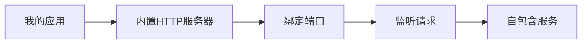

- 应用即服务（一个应用 = 一个服务）
- 开发/生产环境完全一致
- 简化部署和扩展

**应用自己处理HTTP请求，不依赖外部服务器。端口通过端口号来暴露服务**

**像“一包薯片”：**

| **薯片特性** | **应用特性** | **技术体现** |
| --- | --- | --- |
| 独立包装 | 自包含 | 内置HTTP服务器 |
| 开袋即食 | 开箱即用 | `python app.py`直接运行 |
| 内容完整 | 功能完整 | 不依赖外部Web服务器 |
| 标准规格 | 统一接口 | 通过端口暴露服务 |

# 8、**并发性：通过进程模型横向扩展**

这个原则的核心是**将应用拆分为可独立扩展的进程类型**

**图解：**

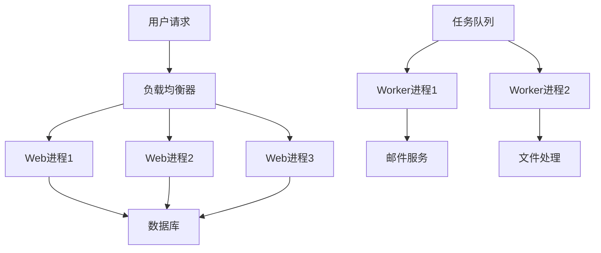

**进程类型：**

| 进程类型 | 职责 | 示例 | 扩展方式 |
| --- | --- | --- | --- |
| Web进程 | 处理HTTP请求 | Gunicorn/Uvicorn | 增加`workers` |
| Worker进程 | 处理后台任务 | Celery/Redis Queue | 增加worker数量 |
| Clock进程 | 定时任务 | Celery Beat | 单实例运行 |

**进程模型 vs 线程模型：**

| 特性 | 进程模型 | 线程模型 |
| --- | --- | --- |
| 隔离性 | 完全隔离 | 共享内存 |
| 稳定性 | 崩溃不影响其他 | 线程崩溃导致整个进程崩溃 |
| 扩展性 | 跨机器扩展 | 单机限制 |
| 编程复杂度 | 简单 | 需要锁机制 |
| 适用场景 | 通用 | CPU密集型计算 |

### **扩展策略：**

**垂直扩展（升级服务器）：**

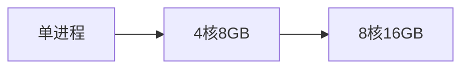

**水平扩展（增加进程）：**

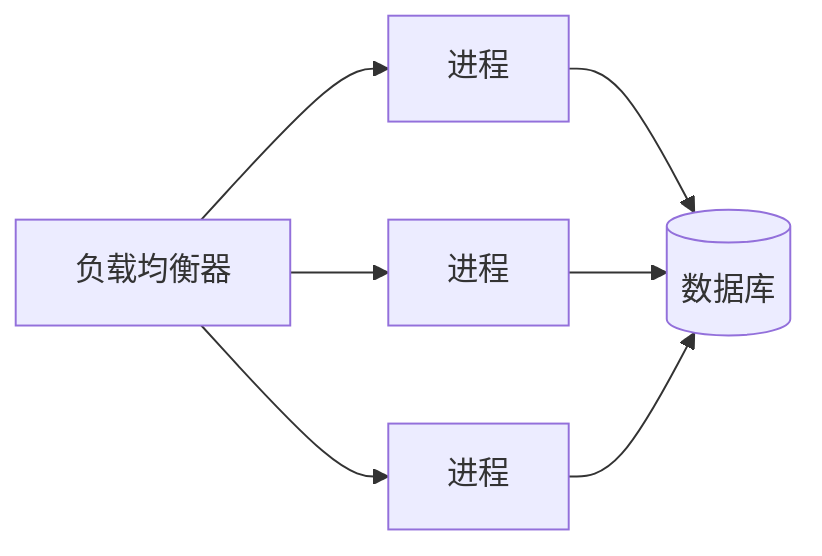

**混合扩展:**

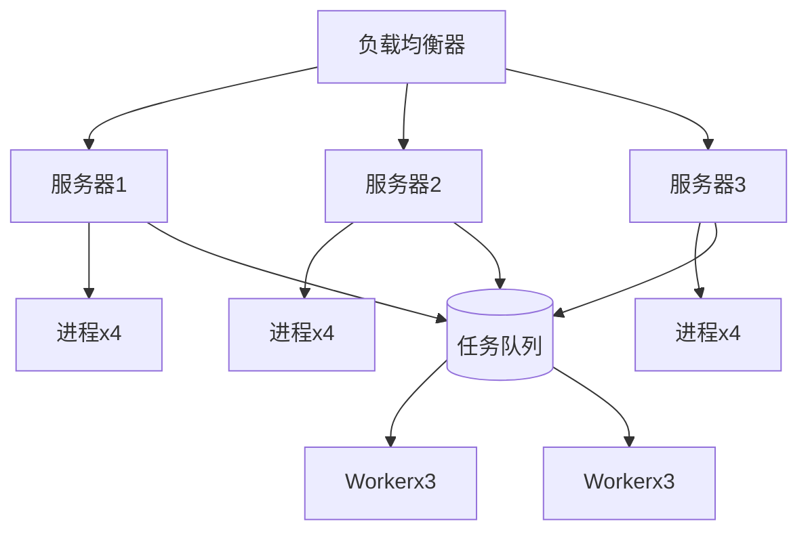

**python的多进程之间通信我们可以使用消息队列来进行**

这个原则的重要性：

1. **弹性扩展**：根据负载动态调整进程数量
2. **故障隔离**：单个进程崩溃不影响整体服务
3. **资源优化**：为不同任务分配专用资源
4. **零停机部署**：滚动更新进程
5. **多云支持**：跨云厂商分布式部署

# 9、**可处置性：快速启动和正常关闭**

**12 因素应用程序的[进程](https://12factor.net/processes)是一次性的，这意味着它们可以随时启动或停止。** 这有助于快速弹性扩展、 [快速部署代码](https://12factor.net/codebase)或[配置](https://12factor.net/config)更改以及生产部署的稳健性。

```python
import signal
import sys

def graceful_shutdown(signum, frame):
    print("Received shutdown signal, cleaning up...")
    # 关闭数据库连接
    db.close()
    # 清除缓存
    cache.clear()
    sys.exit(0)

signal.signal(signal.SIGTERM, graceful_shutdown)
```

# 10、**Dev/Prod Parity：保持环境相似**

***12 因素应用程序旨在通过 缩小开发和生产之间的差距来实现[持续部署](http://avc.com/2011/02/continuous-deployment/)*** 

*缩小时间间隔：开发人员可能会编写代码并在数小时甚至几分钟后部署它。*

*缩小人员差距：编写代码的开发人员密切参与部署代码并观察其在生产中的行为。*

*缩小工具差距：保持开发和生产尽可能相似。*

# 11、**日志：将日志视为事件流**

**将日志视为连续的事件流而非静态文件。就像排队上洗手间一样，日志是持续流动的，需要实时处理而非批量操作。**

```python
import logging
import sys

def setup_logging():
    # 关键配置：日志输出到stdout而非文件
    logging.basicConfig(
        format='%(asctime)s - %(name)s - %(levelname)s - %(message)s',
        level=logging.INFO,
        stream=sys.stdout  # 输出到标准输出
    )
    logger = logging.getLogger(__name__)
    return logger

logger = setup_logging()
logger.info("Tea's ready!")  # 日志事件流
```

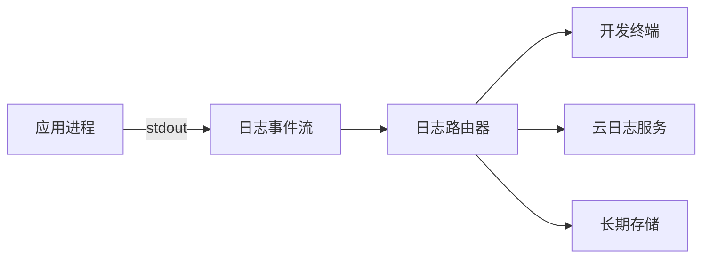

**传统日志问题：**

- 日志文件管理复杂
- 多进程日志合并困难
- 磁盘空间管理挑战
- 实时分析困难

**事件流日志：**

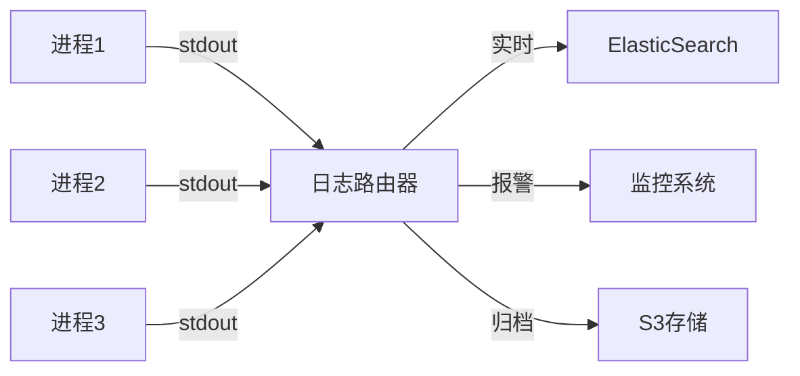

**优势**：

- 实时处理能力
- 集中式管理
- 资源消耗低
- 跨进程/服务关联

**实现关键要素：**

**1. 写入标准输出(stdout)**

```python
stream=sys.stdout  # 核心配置
```

- 应用只负责生成日志事件
- 不关心日志的去向和存储
- 无缓冲输出确保实时性

```python
# 错误：直接写入文件
logging.basicConfig(filename='app.log') 

# 正确：输出到stdout
logging.basicConfig(stream=sys.stdout)
```

# 12、**管理流程：将管理/管理任务作为一次性流程运行**

**管理任务应该像邮局队列一样井然有序、独立执行，与主应用分离但共享相同环境**

```python
import click  # 强大的CLI构建库

@click.group()
def cli():
    """Admin tasks for our application"""
    pass  # 创建命令组容器

@cli.command()
def migrate_db():
    """Run database migrations"""
    click.echo("Running migrations...")
    # 实际迁移逻辑（与主应用共享模型）
    from app.models import db, migrate
    migrate.upgrade()

@cli.command()
def clear_cache():
    """Clear application cache"""
    click.echo("Clearing cache...")
    # 使用主应用相同的缓存客户端
    from app.cache import redis_client
    redis_client.flushall()

if __name__ == "__main__":
    cli()  # 启动CLI
```

### **核心概念图解：**

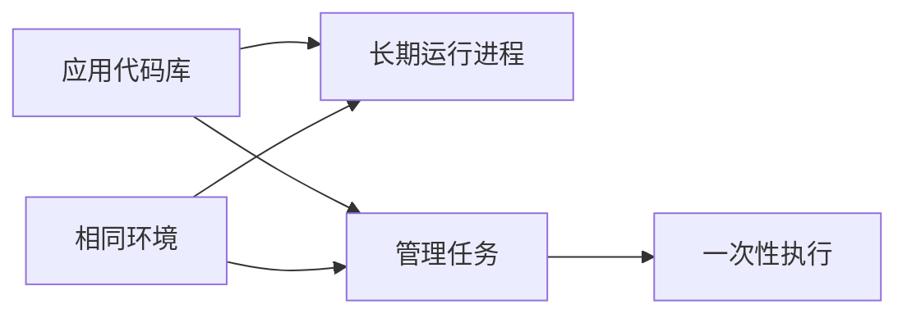

### **传统管理 vs 12-Factor管理:**

**❌ 传统方式**

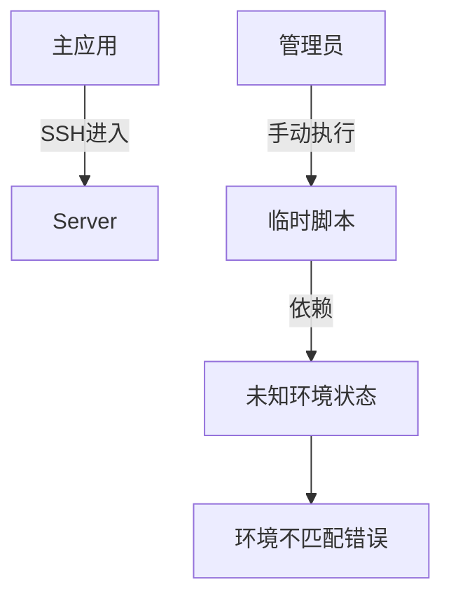

**问题**：

- 环境不一致导致"在我机器上能运行"
- 临时脚本难以维护
- 安全风险（直接访问生产环境）
- 操作不可追溯

**✅ 12-Factor方式**

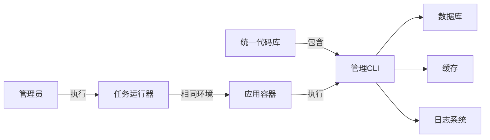

### **关键实现要素：**

**1. 环境一致性保证**

```python
# 使用与应用相同的配置
from app.config import DATABASE_URI

def migrate_db():
    # 使用主应用的数据库配置
    engine = create_engine(DATABASE_URI)
    # 迁移操作...
```

**2. 代码同源**

```python
# 管理命令与主应用共享相同模块
from app.models import User, Order  # 相同数据模型
from app.utils import send_email    # 相同工具函数
```

**3. 一次性流程特性**

| 特性 | 实现方式 | 优势 |
| --- | --- | --- |
| 独立执行 | CLI命令 | 不影响主应用 |
| 有限生命周期 | 进程退出 | 资源自动释放 |
| 明确输入输出 | Click参数 | 可脚本化 |
| 状态可追踪 | 日志输出 | 审计追踪 |

**"邮局队列"：**

| 邮局队列 | 管理任务 | 技术体现 |
| --- | --- | --- |
| 专用窗口 | 独立进程 | CLI命令隔离 |
| 明确流程 | 标准化 | Click命令结构 |
| 即到即办 | 一次性 | 执行后退出 |
| 统一管理 | 代码同源 | 共享代码库 |

> 就像邮局为不同服务设立专门窗口，现代应用应该为管理任务创建标准化接口。这种分离但统一的架构，确保了管理操作的可靠性和安全性。
> 
- 每个任务都有专用"服务窗口"(CLI命令)
- 所有窗口共享相同"工作环境"(应用运行时)
- 任务完成后"窗口关闭"(进程退出)
- 完整"服务记录"(日志审计追踪)

### **CLI（命令行界面）-Docker CLI、Git CLI  python中使用Click**

CLI（Command-Line Interface）是**命令行界面**的缩写，是一种允许用户通过文本命令与计算机程序交互的界面。它就像计算机的"控制台"，用户通过输入特定指令来操作系统或应用程序。

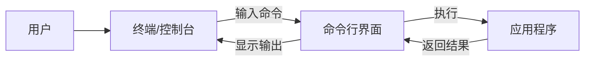

**示例：**

```python
import click  # CLI构建库

# 1. 创建命令组容器
@click.group()
def cli():
    """管理任务入口点"""
    pass

# 2. 定义子命令
@cli.command()
def migrate_db():
    """数据库迁移命令"""
    click.echo("执行数据库迁移...")
    # 实际迁移逻辑

# 3. 命令执行器
if __name__ == "__main__":
    cli()  # 启动CLI解析器
```

### **执行流程：**

1. 用户在终端输入：`python manage.py migrate_db`
2. Python解释器执行脚本
3. `cli()` 函数解析命令
4. 匹配并执行 `migrate_db()` 函数
5. 输出结果到终端